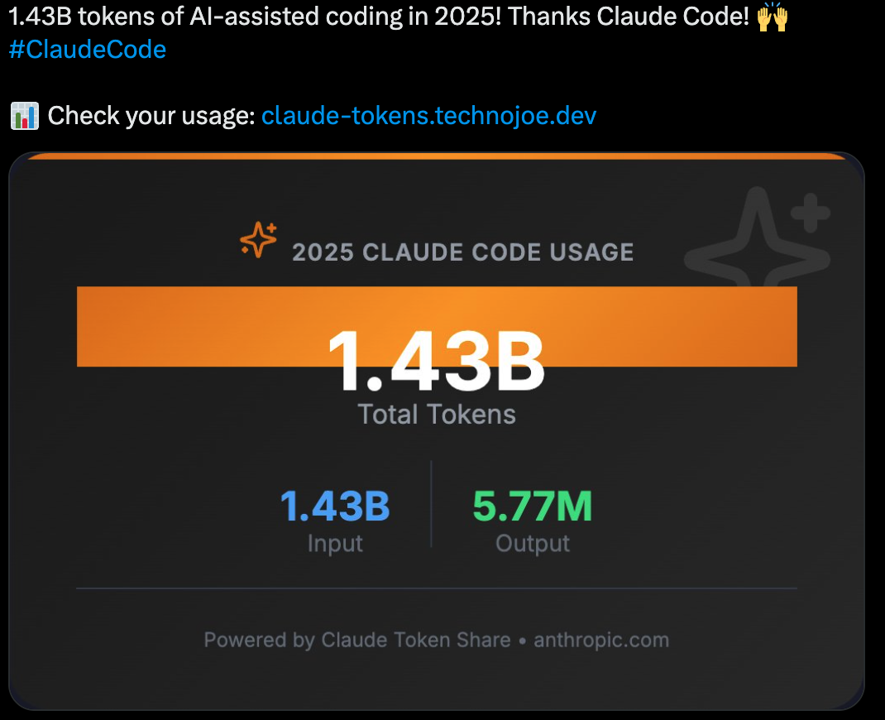
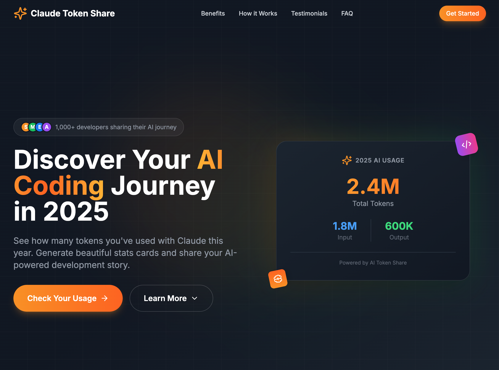
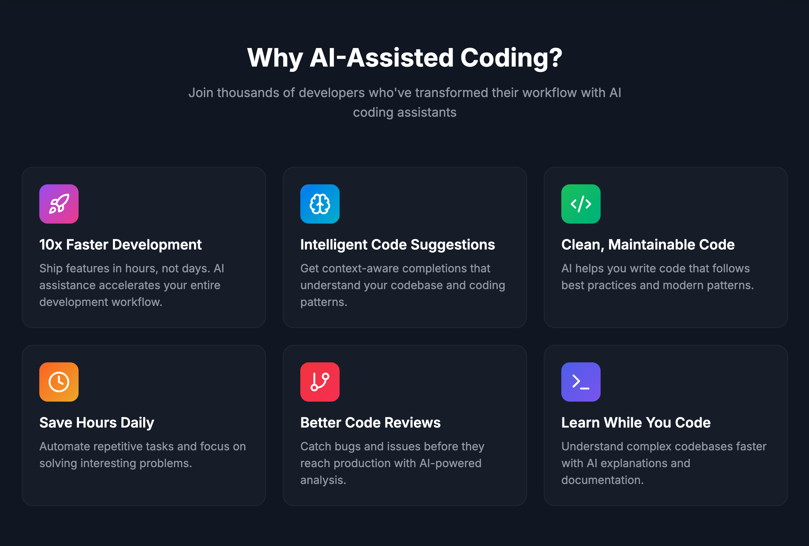
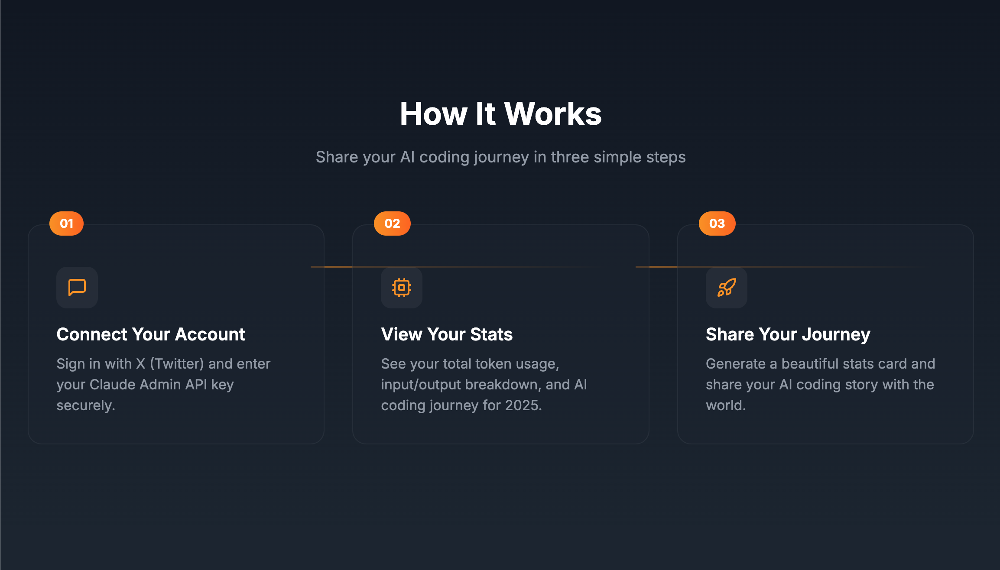
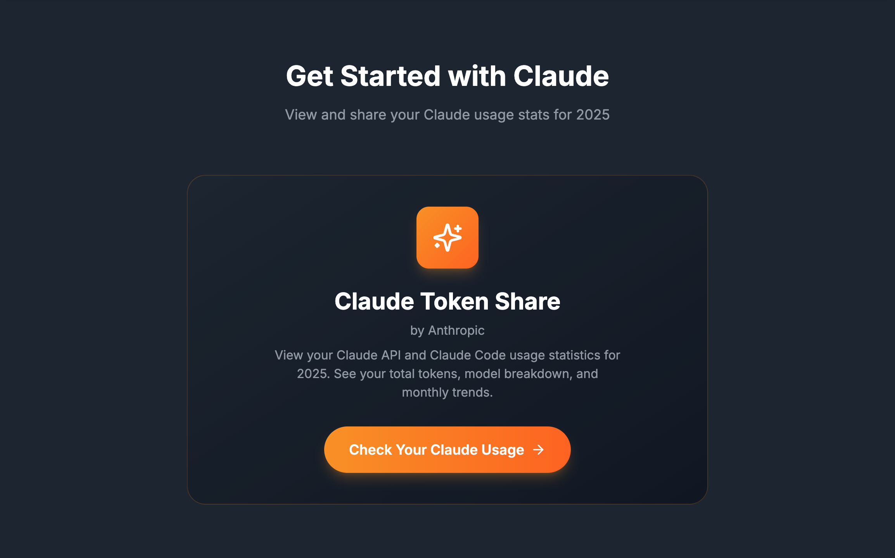
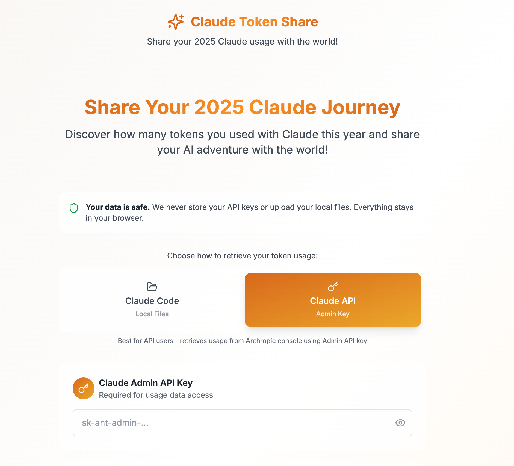
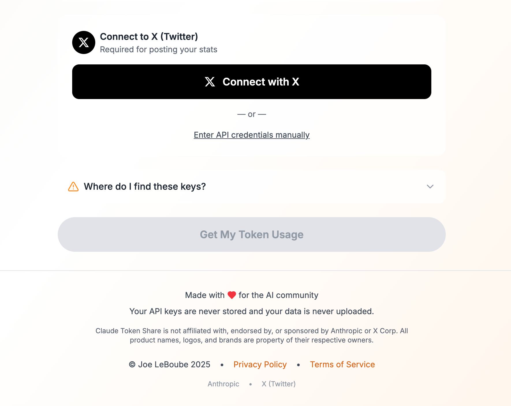

<div align="center">

# ClaudeTokenShare


[](https://www.buymeacoffee.com/muscl3n3rd)

Share your 2025 Claude AI token usage on X (Twitter)!


[Demo](https://claude-tokens.technojoe.dev) • [Screenshots](#screenshots) • [Features](#features) • [Quick Start](#getting-started) • [API Keys](#api-keys-required)

</div>

## Screenshots

Strands GUI Landing Page








## Overview

ClaudeTokenShare is a web application that allows users to:
- Retrieve their token usage statistics from the Anthropic API for 2025
- View a beautiful dashboard of their usage data
- Export usage data as JSON
- Share their stats on X with a customizable post

## Features

- **One-Click X Connection**: Connect your X account with OAuth - no API keys needed!
- **Secure**: API keys are never stored - only used in-session
- **Beautiful Dashboard**: See your total tokens, model breakdown, and monthly usage
- **Customizable Posts**: Choose from templates or write your own message
- **One-Click Sharing**: Post directly to X from the app
- **Export Data**: Download your usage stats as JSON

## Prerequisites

- **Claude Admin API Key**: Get from [console.anthropic.com](https://console.anthropic.com)
- **X Developer Account** (for hosting): Only needed if you're hosting your own instance

## Getting Started

### Using Docker (Recommended)

1. Clone the repository:
   ```bash
   git clone <repository-url>
   cd EOY-CC
   ```

2. Copy and configure environment file:
   ```bash
   cp .env.example .env
   ```

3. Edit `.env` with your X OAuth credentials (see [X OAuth Setup](#x-oauth-setup-for-hosting))

4. Build and run with Docker Compose:
   ```bash
   docker compose up --build
   ```

5. Access the app at `http://localhost:47391`

### Local Development

1. Install dependencies:
   ```bash
   npm install
   ```

2. Copy and configure environment:
   ```bash
   cp .env.example .env
   # Edit .env with your credentials
   ```

3. Run the development server:
   ```bash
   npm run dev
   ```

4. Open [http://localhost:3000](http://localhost:3000)

## How to Use

1. **Connect to X**
   - Click "Connect with X" button
   - Authorize the app on X
   - You'll be redirected back with your account connected

2. **Enter Claude API Key**
   - Paste your Claude Admin API Key (starts with `sk-ant-admin-`)

3. **View Your Stats**
   - See your total token usage for 2025
   - View breakdown by model and month
   - Optionally export the data

4. **Share on X**
   - Choose a template or customize your message
   - Preview how your post will look
   - Click "Post to X" to share

## X OAuth Setup (For Hosting)

To host your own instance, you need to configure X OAuth:

1. Go to [developer.x.com](https://developer.x.com)
2. Create a new project and app (or use existing)
3. Go to your app's **User authentication settings**
4. Configure the following:

   | Setting | Value |
   |---------|-------|
   | **App permissions** | Read and write |
   | **Type of App** | Web App, Automated App or Bot |
   | **Callback URI** | `https://yourdomain.com/api/auth/x/callback` |
   | **Website URL** | `https://yourdomain.com` |

5. Go to **Keys and tokens** and note your:
   - Client ID
   - Client Secret

6. Add to your `.env` file:
   ```bash
   X_CLIENT_ID=your_client_id
   X_CLIENT_SECRET=your_client_secret
   SESSION_SECRET=generate_with_openssl_rand_base64_32
   NEXT_PUBLIC_APP_URL=https://yourdomain.com
   ```

## API Keys Required

### Claude Admin API Key (For Users)
1. Go to [console.anthropic.com](https://console.anthropic.com)
2. Navigate to Settings → API Keys
3. Create or copy your Admin API Key (starts with `sk-ant-admin-`)

### Manual X Credentials (Alternative)
If OAuth isn't configured, users can enter their own X API credentials:
1. Go to [developer.x.com](https://developer.x.com)
2. Create a new app
3. Generate API Key, API Secret, Access Token, and Access Token Secret
4. Ensure your app has Read and Write permissions

## Tech Stack

- **Frontend**: Next.js 16, React 19, TypeScript
- **Styling**: Tailwind CSS
- **Icons**: Lucide React
- **X API**: twitter-api-v2
- **Sessions**: iron-session
- **Deployment**: Docker, Docker Compose

## Security

- Claude API keys are never stored on the server
- X OAuth tokens are stored in encrypted HTTP-only cookies
- All API calls are made server-side
- HTTPS required for production OAuth
- Session data encrypted with iron-session

## Environment Variables

| Variable | Description | Required |
|----------|-------------|----------|
| `X_CLIENT_ID` | X OAuth Client ID | For OAuth |
| `X_CLIENT_SECRET` | X OAuth Client Secret | For OAuth |
| `SESSION_SECRET` | Encryption key for sessions | Yes |
| `NEXT_PUBLIC_APP_URL` | Your app's public URL | Yes |

## License

MIT

---

[](https://linkedin.com/in/joe-leboube)
